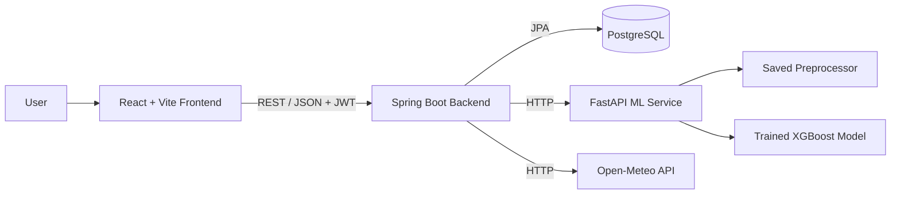

# AgriSense AI

**AgriSense AI** is a full-stack academic prototype for agricultural data management and AI-assisted irrigation-need prediction.

The platform enables authenticated users to manage crops, parcels, and agricultural activities, view personalized dashboard statistics, import and export agricultural data, retrieve weather information, and generate machine-learning-supported irrigation recommendations.

The system combines a React frontend, Spring Boot REST API, PostgreSQL database, FastAPI machine learning service, and Docker Compose.

> Developed by Team 38 for the **ICT Project Management** course.

---

## Overview

AgriSense AI demonstrates how modern web technologies, external data sources, secure authentication, relational persistence, and machine learning can be integrated into a single agricultural decision-support platform.

The application provides:

- secure user registration and authentication
- JWT-based authorization
- user-owned agricultural records
- crop, parcel, and agricultural activity management
- personalized dashboard statistics
- search and filtering
- live weather integration through Open-Meteo
- CSV and Excel import/export
- machine-learning-assisted irrigation-need prediction
- role-based administration
- Dockerized multi-service deployment

The project is designed as a working academic prototype with a clear separation between frontend, backend, database, and machine learning components.

---

## Main Features

### Authentication and Security

- User registration and login
- JWT-based authentication
- BCrypt password hashing
- Stateless Spring Security configuration
- Protected backend endpoints
- User-owned agricultural data
- Role-based authorization
- Backend-enforced `ADMIN` access
- Protected frontend routes
- Configurable CORS policy
- Structured API error responses
- Request validation

### Agricultural Data Management

Users can create, view, search, edit, and delete:

- crops
- parcels
- agricultural activities

Each record belongs to the authenticated user.

User identity is derived from the authenticated Spring Security context and is not supplied through a normal `userId` request parameter.

### Dashboard

The dashboard provides statistics for the currently authenticated user:

- number of crops
- number of parcels
- number of activities
- total agricultural records

It also provides search and record-management functionality.

### Import and Export

Supported formats:

- CSV
- Microsoft Excel (`.xlsx`)

Supported data:

- crops
- parcels
- activities

Imported data automatically belongs to the authenticated user.

### Weather Integration

The backend integrates with the Open-Meteo API and exposes weather information for supplied geographic coordinates.

Weather information includes data such as:

- temperature
- humidity
- precipitation
- wind speed

The React frontend communicates only with the Spring Boot backend. External weather requests are handled by the backend.

### AI Recommendations

The Spring Boot backend communicates with a separate FastAPI service that hosts the trained machine learning model.

The ML service processes agricultural, soil, weather, crop, and field-related input and predicts one of three irrigation-need classes:

```text
Low
Medium
High
```

Prediction probabilities are returned when supported by the trained classifier.

### Administration

Users with the `ADMIN` role can access administrative functionality for:

- users
- crops
- parcels
- activities

Administrative authorization is enforced by Spring Security on the backend and reflected in frontend routing.

---

## System Architecture



The system consists of four primary application components:

| Component | Technology | Purpose |
|---|---|---|
| Frontend | React + Vite | User interface |
| Backend | Spring Boot | REST API, security and business logic |
| Database | PostgreSQL | Persistent application data |
| ML Service | FastAPI | Irrigation-need prediction |

Docker Compose runs the complete system as a multi-container application.

---

## Technology Stack

### Frontend

- React
- Vite
- React Router
- JavaScript
- CSS
- Nginx

### Backend

- Java 21
- Spring Boot
- Spring Web
- Spring Data JPA
- Spring Security
- Bean Validation
- JJWT
- PostgreSQL Driver
- Apache POI
- OpenCSV
- Springdoc OpenAPI
- Gradle

### Database

- PostgreSQL
- H2 for automated backend tests

### Machine Learning

- Python 3.11
- FastAPI
- Uvicorn
- pandas
- NumPy
- scikit-learn
- XGBoost
- joblib

### DevOps and Tooling

- Git
- GitHub
- Docker
- Docker Compose
- Gradle
- npm
- Jira

---

## Project Structure

```text
agrisense-ai/
├── backend/
│   ├── src/
│   │   ├── main/
│   │   └── test/
│   ├── gradle/
│   ├── Dockerfile
│   └── build.gradle
│
├── frontend/
│   ├── public/
│   ├── src/
│   ├── Dockerfile
│   ├── nginx.conf
│   ├── package.json
│   └── vite.config.js
│
├── ml/
│   ├── app/
│   │   ├── feature_engineering.py
│   │   ├── main.py
│   │   ├── model_loader.py
│   │   ├── schemas.py
│   │   └── utils.py
│   ├── data/
│   │   └── irrigation_prediction.csv
│   ├── notebooks/
│   │   └── model_selection.ipynb
│   ├── trained_model_objects/
│   │   ├── healthy_soil_moisture_threshold.pkl
│   │   ├── irrigation_model.pkl
│   │   ├── label_encoder.pkl
│   │   └── preprocessor.pkl
│   ├── Dockerfile
│   ├── README.md
│   └── requirements.txt
│
├── docs/
│   ├── research/
│   │   └── weather-api-research.md
│   ├── database.sql
│   ├── import-export-specification.md
│   └── project-specification.pdf
│
├── .env.example
├── .gitignore
├── docker-compose.yml
└── README.md
```

---

## Security Model

AgriSense AI uses stateless JWT authentication.

After successful registration or login, the backend returns a JWT token.

The frontend includes the token in protected API requests:

```http
Authorization: Bearer <token>
```

Spring Security validates the token before allowing access to protected resources.

### Public Endpoints

Selected endpoints are available without authentication:

```http
POST /api/users/register
POST /api/users/login

GET  /api/weather
GET  /api/health
```

Swagger/OpenAPI resources are also publicly accessible for API documentation.

### Authenticated Endpoints

Agricultural records, dashboard data, profile management, import/export, and recommendation functionality require authentication.

### Administrator Endpoints

Routes under:

```text
/api/admin/**
```

require the authenticated user to have the `ADMIN` role.

### Data Ownership

Crop, parcel, and agricultural activity operations are scoped to the authenticated user.

For example:

```http
GET /api/crops
```

returns only crops belonging to the current user.

Clients cannot access another user's records by supplying a different user ID.

---

## REST API Overview

### Authentication and Profile

```http
POST /api/users/register
POST /api/users/login

GET  /api/users/me
PUT  /api/users/me
```

Logout is handled on the frontend by removing the locally stored authentication state.

---

### Crops

```http
GET    /api/crops
GET    /api/crops?search=tomato
GET    /api/crops/{id}

POST   /api/crops
PUT    /api/crops/{id}
DELETE /api/crops/{id}
```

Example request:

```json
{
  "name": "Tomato",
  "type": "Vegetable",
  "plantingDate": "2026-05-15"
}
```

---

### Parcels

```http
GET    /api/parcels
GET    /api/parcels?search=loamy
GET    /api/parcels/{id}

POST   /api/parcels
PUT    /api/parcels/{id}
DELETE /api/parcels/{id}
```

Example request:

```json
{
  "location": "Skopje",
  "size": 1200,
  "soilType": "Loamy"
}
```

---

### Activities

```http
GET    /api/activities
GET    /api/activities?search=irrigation
GET    /api/activities/{id}

POST   /api/activities
PUT    /api/activities/{id}
DELETE /api/activities/{id}
```

Example request:

```json
{
  "description": "Morning irrigation",
  "date": "2026-05-15",
  "type": "Irrigation"
}
```

Dates use ISO format:

```text
yyyy-MM-dd
```

---

### Dashboard

```http
GET /api/dashboard/stats
```

Example response:

```json
{
  "cropsCount": 5,
  "parcelsCount": 3,
  "activitiesCount": 8,
  "totalRecords": 16
}
```

Statistics are calculated only for the authenticated user.

---

### Weather

```http
GET /api/weather?latitude=41.9981&longitude=21.4254
```

Example coordinates:

```text
Latitude:  41.9981
Longitude: 21.4254
```

The backend retrieves the corresponding weather information from Open-Meteo.

---

### Recommendations

```http
POST /api/recommendations
```

The backend validates the recommendation request and communicates with the FastAPI ML service.

The browser does not call the FastAPI service directly.

---

### Import and Export

```http
GET  /api/data/export/crops
POST /api/data/import/crops

GET  /api/data/export/parcels
POST /api/data/import/parcels

GET  /api/data/export/activities
POST /api/data/import/activities

GET  /api/data/export/excel
POST /api/data/import/excel
```

No `userId` parameter is required.

The authenticated user is determined by the backend from the security context.

---

### Administration

```http
GET    /api/admin/users
GET    /api/admin/crops
GET    /api/admin/parcels
GET    /api/admin/activities

DELETE /api/admin/users/{id}
DELETE /api/admin/crops/{id}
DELETE /api/admin/parcels/{id}
DELETE /api/admin/activities/{id}
```

These endpoints require the `ADMIN` role.

---

## API Error Format

Backend errors use a consistent JSON structure.

Example validation error:

```json
{
  "timestamp": "2026-09-13T12:00:00",
  "status": 400,
  "error": "Bad Request",
  "message": "Validation failed.",
  "path": "/api/users/register",
  "validationErrors": {
    "email": "Email must be valid.",
    "password": "Password must contain between 6 and 72 characters."
  }
}
```

The API uses HTTP status codes including:

```text
400 Bad Request
401 Unauthorized
403 Forbidden
404 Not Found
409 Conflict
500 Internal Server Error
```

---

## Import and Export Formats

### Crops CSV

```csv
name,type,plantingDate
Tomato,Vegetable,2026-05-15
Wheat,Cereal,2026-04-20
Apple,Fruit,2026-03-10
```

### Parcels CSV

```csv
location,size,soilType
Skopje,1200,Loamy
Bitola,850,Clay
Ohrid,600,Sandy
```

### Activities CSV

```csv
description,date,type
Morning irrigation,2026-05-15,Irrigation
Soil fertilization,2026-05-16,Fertilization
Pest inspection,2026-05-17,Crop Protection
```

Excel export produces:

```text
agriculture-data.xlsx
```

with separate sheets:

```text
Crops
Parcels
Activities
```

Both CSV and Excel imports validate their required fields and date formats before records are persisted.

---

# Machine Learning Service

The machine learning component runs as an independent FastAPI service.

Its main endpoints are:

```http
GET  /health
POST /predict
```

Local service URL:

```text
http://localhost:8000
```

FastAPI documentation:

```text
http://localhost:8000/docs
```

The Spring Boot backend communicates with this service through:

```text
ML_SERVICE_URL
```

In Docker Compose:

```text
http://ml-service:8000
```

---

## ML Model

The model predicts one of the following irrigation-need classes:

```text
Low
Medium
High
```

The final selected classifier is based on XGBoost.

The training workflow, model comparison, preprocessing, evaluation, and feature engineering are documented in:

```text
ml/notebooks/model_selection.ipynb
```

The training dataset is stored in:

```text
ml/data/irrigation_prediction.csv
```

The runtime model artifacts are stored in:

```text
ml/trained_model_objects/
```

---

## ML Feature Engineering

The API receives 19 raw features.

Before prediction, four additional features are generated:

```text
Moisture_Deficit
Water_Availability
ET_Proxy
Irrigation_per_Hectare
```

The final model input therefore contains 23 features.

---

## ML Training Categories

The categorical values represented in the training dataset are:

### Soil Type

```text
Clay
Loamy
Sandy
Silt
```

### Crop Type

```text
Cotton
Maize
Potato
Rice
Sugarcane
Wheat
```

### Crop Growth Stage

```text
Sowing
Vegetative
Flowering
Harvest
```

### Season

```text
Rabi
Kharif
Zaid
```

### Irrigation Type

```text
Canal
Drip
Rainfed
Sprinkler
```

### Water Source

```text
Groundwater
Rainwater
Reservoir
River
```

### Mulching Used

```text
Yes
No
```

### Region

```text
Central
East
North
South
West
```

Inputs using categories represented in the training dataset are recommended so that inference remains consistent with the model's training distribution.

---

## Recommendation Request Example

```json
{
  "Soil_pH": 6.8,
  "Soil_Moisture": 32.0,
  "Organic_Carbon": 1.2,
  "Electrical_Conductivity": 0.8,
  "Temperature_C": 32.0,
  "Humidity": 35.0,
  "Rainfall_mm": 2.0,
  "Sunlight_Hours": 8.0,
  "Wind_Speed_kmh": 12.0,
  "Field_Area_hectare": 1.5,
  "Previous_Irrigation_mm": 5.0,
  "Soil_Type": "Loamy",
  "Crop_Type": "Wheat",
  "Crop_Growth_Stage": "Vegetative",
  "Season": "Kharif",
  "Irrigation_Type": "Drip",
  "Water_Source": "Groundwater",
  "Mulching_Used": "Yes",
  "Region": "Central"
}
```

Example ML response:

```json
{
  "predictions": [
    {
      "label": "Medium",
      "probabilities": {
        "High": 0.05,
        "Low": 0.15,
        "Medium": 0.8
      }
    }
  ]
}
```

The exact result and probability values depend on the supplied input and trained model.

---

# Getting Started

## Prerequisites

For Docker-based startup:

- Docker
- Docker Compose

For manual development:

- Java 21
- Node.js
- npm
- Python 3.11
- PostgreSQL

---

## Environment Configuration

Copy the public environment template before starting the application.

### Windows PowerShell

```powershell
Copy-Item .env.example .env
```

### Linux / macOS

```bash
cp .env.example .env
```

The configuration template contains:

```env
POSTGRES_DB=agriculture_db
POSTGRES_USER=postgres
POSTGRES_PASSWORD=change_me

SPRING_JPA_HIBERNATE_DDL_AUTO=update
ML_SERVICE_URL=http://ml-service:8000

VITE_API_BASE_URL=http://localhost:8080

JWT_SECRET=REPLACE_WITH_32_BYTE_BASE64_SECRET
JWT_EXPIRATION_MS=86400000

CORS_ALLOWED_ORIGINS=http://localhost:5173
```

Before starting the application, replace:

```text
POSTGRES_PASSWORD
JWT_SECRET
```

with secure local values.

The `.env` file is ignored by Git and must not be committed.

---

## Generate a JWT Secret

The JWT secret should contain a sufficiently long random Base64-encoded value.

Using OpenSSL:

```bash
openssl rand -base64 32
```

Copy the generated value into:

```env
JWT_SECRET=<generated-value>
```

The real secret must remain only in the local `.env` file or an appropriate deployment secret-management system.

---

# Running with Docker Compose

Docker Compose is the recommended way to start the complete application.

From the repository root:

```bash
docker compose up --build
```

This starts:

```text
PostgreSQL
Spring Boot backend
FastAPI ML service
React/Nginx frontend
```

After startup:

| Service | URL |
|---|---|
| Frontend | http://localhost:5173 |
| Backend | http://localhost:8080 |
| Backend Health | http://localhost:8080/api/health |
| Swagger UI | http://localhost:8080/swagger-ui.html |
| ML Service | http://localhost:8000 |
| ML Health | http://localhost:8000/health |
| ML Documentation | http://localhost:8000/docs |

Stop the application:

```bash
docker compose down
```

Stop the application and delete the PostgreSQL volume:

```bash
docker compose down -v
```

> `docker compose down -v` permanently removes the local Docker database volume and should only be used when a clean database reset is intended.

---

# Manual Development

## Backend

Ensure PostgreSQL is running and configure the required environment variables for the local database.

### Windows

```powershell
cd backend
.\gradlew.bat bootRun
```

### Linux / macOS

```bash
cd backend
./gradlew bootRun
```

Backend:

```text
http://localhost:8080
```

Swagger UI:

```text
http://localhost:8080/swagger-ui.html
```

---

## Frontend

```bash
cd frontend
npm ci
npm run dev
```

Frontend:

```text
http://localhost:5173
```

The frontend communicates with the backend using:

```env
VITE_API_BASE_URL=http://localhost:8080
```

---

## Machine Learning Service

### Windows PowerShell

```powershell
cd ml
python -m venv .venv
.venv\Scripts\Activate.ps1
pip install -r requirements.txt
uvicorn app.main:app --reload --port 8000
```

### Linux / macOS

```bash
cd ml
python -m venv .venv
source .venv/bin/activate
pip install -r requirements.txt
uvicorn app.main:app --reload --port 8000
```

ML service:

```text
http://localhost:8000
```

FastAPI documentation:

```text
http://localhost:8000/docs
```

---

# Testing

## Backend Tests

### Windows

```powershell
cd backend
.\gradlew.bat clean test
```

### Linux / macOS

```bash
cd backend
./gradlew clean test
```

The backend test suite covers areas including:

- application-context startup
- authentication
- authorization
- invalid credentials
- protected endpoints
- validation errors
- duplicate users
- missing resources
- case-insensitive email handling
- CSV import/export
- Excel import/export
- date parsing and validation

---

## Frontend Validation

```bash
cd frontend
npm ci
npm run lint
npm run build
```

These commands verify frontend code quality and confirm that a production build can be generated successfully.

---

## Docker Compose Validation

Validate the Compose configuration:

```bash
docker compose config --quiet
```

Build all images:

```bash
docker compose build
```

Start the complete system:

```bash
docker compose up -d
```

Check container state:

```bash
docker compose ps
```

---

# Frontend Pages

The React application contains the main pages required to demonstrate the platform:

```text
Home
Login
Register
Dashboard
Data Entry
Profile
Recommendations
Import / Export
Weather
Admin
```

Protected routes prevent unauthenticated users from opening secured application pages.

The Admin page additionally requires the `ADMIN` role.

---

# Data Validation

Backend request DTOs use Bean Validation.

Validation includes areas such as:

- required names and descriptions
- valid email addresses
- password-length constraints
- maximum text lengths
- parcel-size validation
- required dates
- ISO `LocalDate` parsing
- recommendation input validation
- structured malformed-request handling

Invalid request bodies return HTTP `400 Bad Request`.

The FastAPI ML service performs an additional validation layer for prediction input.

---

# Demonstration Flow

A recommended demonstration sequence is:

1. Open the AgriSense AI home page.
2. Register a new account.
3. Log in and demonstrate JWT-protected navigation.
4. Add a crop, parcel, and agricultural activity.
5. Open the dashboard and view personalized statistics.
6. Search agricultural records.
7. Demonstrate edit and delete operations.
8. Open the Weather page.
9. Generate an AI-assisted irrigation recommendation.
10. Export user data as CSV or Excel.
11. Import agricultural data.
12. Open the profile page.
13. Optionally demonstrate `ADMIN` functionality.

For a shorter demonstration:

```text
Authentication
Dashboard
Data Entry
Weather
AI Recommendations
Import / Export
```

---

# Project Context

The project was developed incrementally through multiple phases, including:

- team organization and topic selection
- requirements and specification preparation
- Jira and GitHub setup
- backend and frontend initialization
- relational database development
- user authentication
- agricultural CRUD functionality
- dashboard implementation
- search and filtering
- machine learning research and model integration
- Open-Meteo weather integration
- CSV and Excel import/export
- Docker integration
- authentication and authorization hardening
- automated backend testing
- final integration and documentation

---

# Current Status

AgriSense AI is a working academic prototype with its primary application components integrated.

Implemented functionality includes:

```text
React frontend
Spring Boot REST API
PostgreSQL persistence
FastAPI ML service
JWT authentication
Spring Security authorization
User-owned agricultural data
ADMIN role enforcement
Crop management
Parcel management
Activity management
Profile management
Personalized dashboard statistics
Search and filtering
Open-Meteo weather integration
AI-assisted irrigation-need prediction
CSV import/export
Excel import/export
Request validation
Structured API error handling
Automated backend tests
Docker Compose environment
```

---

# Future Improvements

Potential future development includes:

- refresh-token authentication
- account email verification
- password-reset workflow
- database migrations with Flyway or Liquibase
- production-grade secret management
- expanded integration and end-to-end tests
- CI/CD pipeline
- cloud deployment
- advanced dashboard analytics
- expanded machine learning evaluation
- additional agricultural recommendation models
- deeper integration between live weather data and ML predictions
- centralized production logging and monitoring
- further accessibility improvements
- additional responsive UI refinements

---

# Team

**Team 38 — ICT Project Management**

1. Nikola Sarafimov
2. Sofija Andonova
3. Atanas Vitanov
4. Marko Trajkovski
5. Kire Boškovski
6. Ivan Perchuklieski
7. Mila Todorovska
8. Barbara Popovska
9. Nikola Popov
10. Zagorka Anevska

---

## Project Theme

**Artificial Intelligence in Agriculture**

**Selected topic:**

Intelligent System for Analysis and Recommendations in Agriculture

---

## Status

```text
Project: AgriSense AI
Type: Full-stack academic prototype
Course: ICT Project Management
Team: 38
Status: Working prototype
```